# Wing Bank - Digital Banking for Every Cambodian

## 🌐 Live Demo

[View Live on GitHub Pages](https://pheakboy.github.io/Web-Development-Fundamentals-Assignment/)

## Screenshots

### Desktop

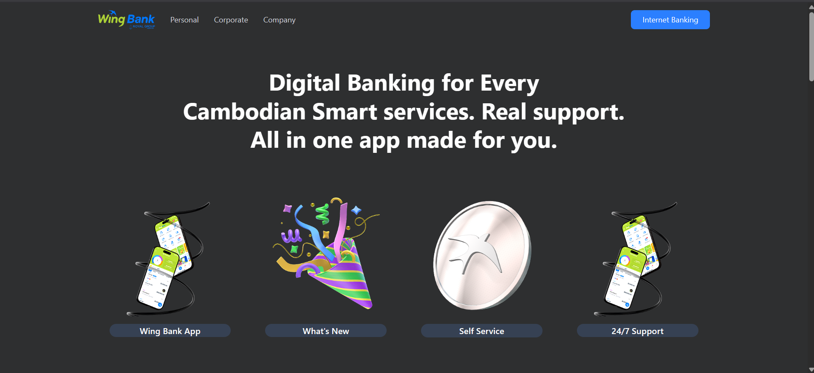
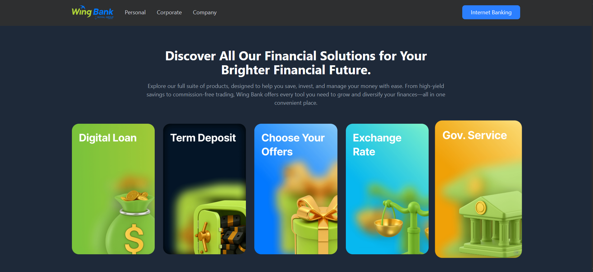
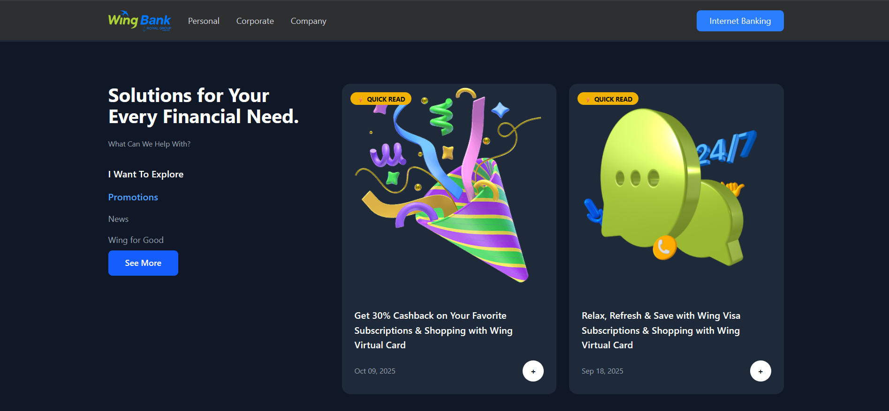
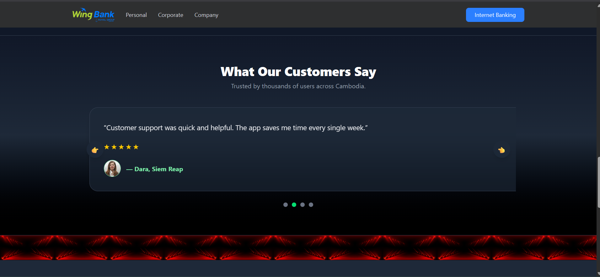
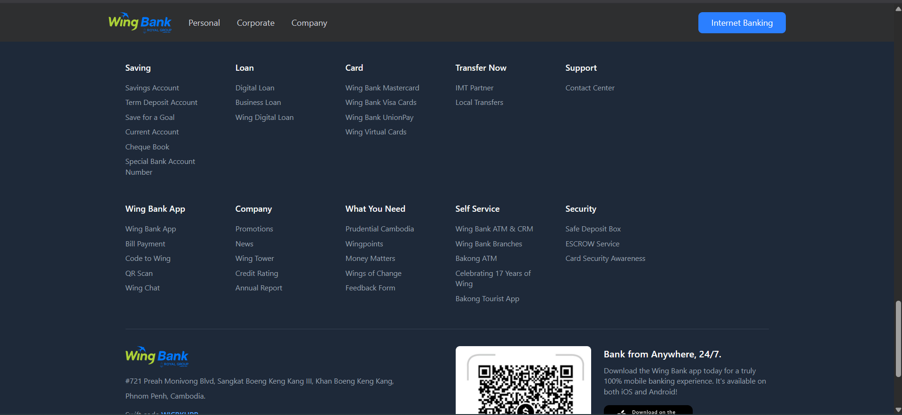

### Mobile

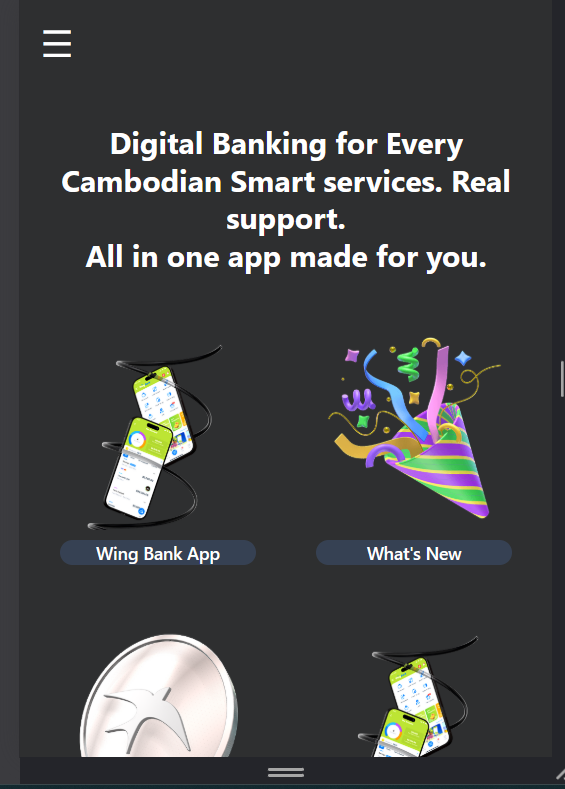
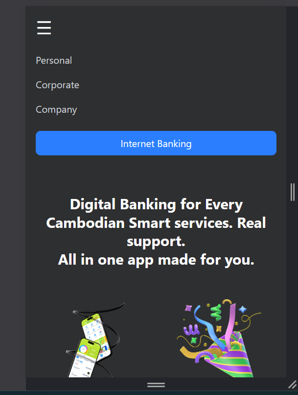
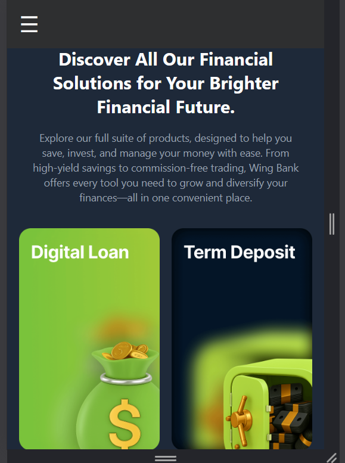
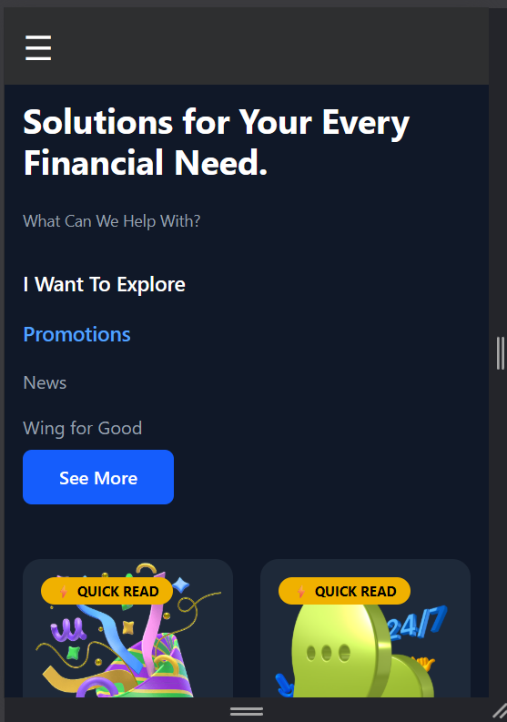
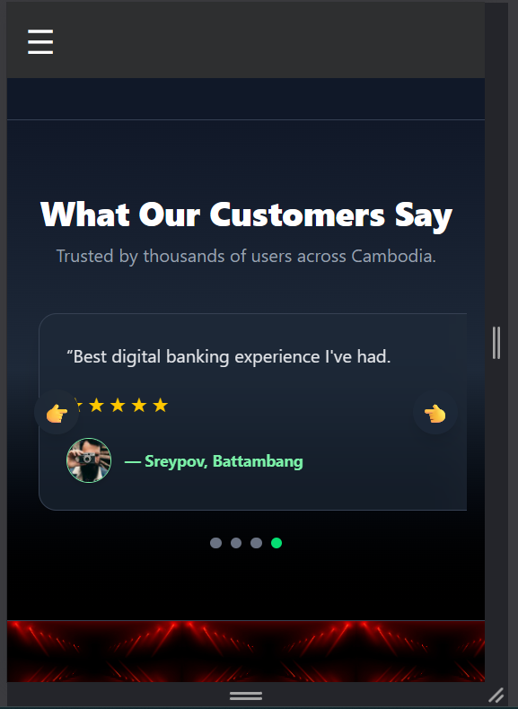
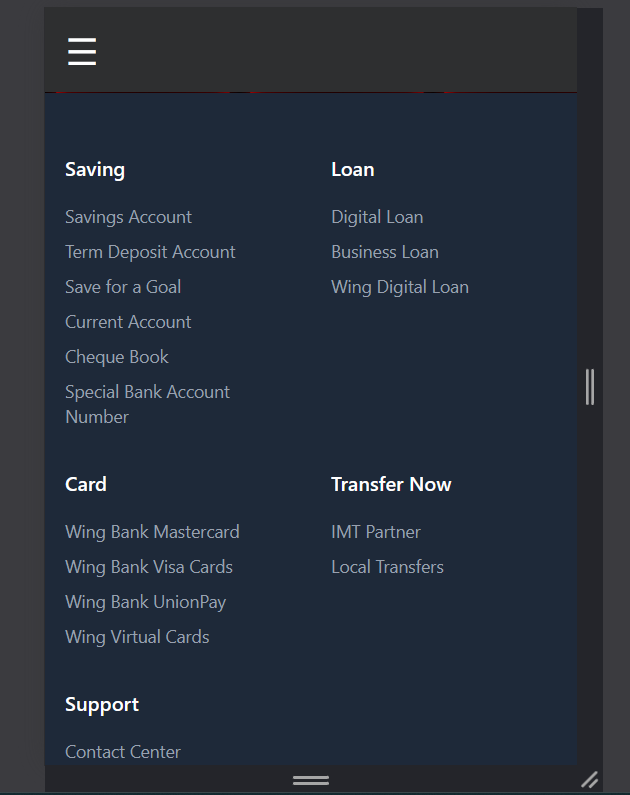
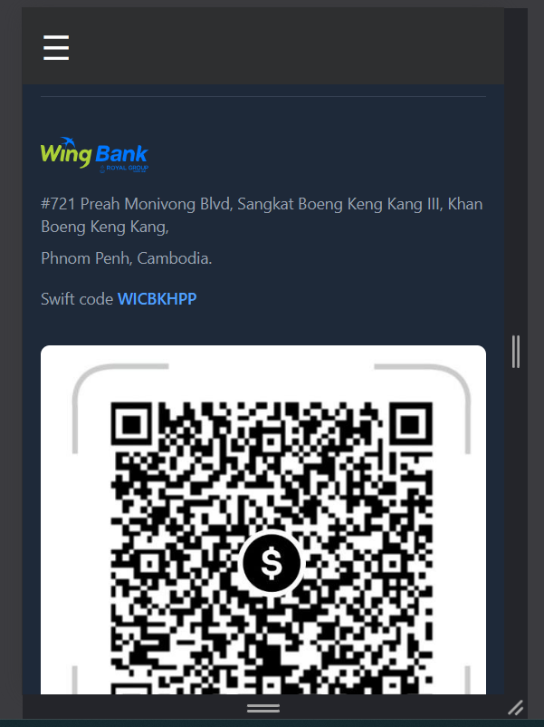

## ✨ Implemented Features

### Navigation & Header

- ✅ Sticky navbar that remains visible while scrolling
- ✅ Responsive desktop navigation menu
- ✅ Mobile hamburger menu with toggle functionality
- ✅ Logo linking to homepage
- ✅ Call-to-action button (Internet Banking)

### Hero Section

- ✅ Eye-catching headline with Wing Bank branding
- ✅ Feature cards (4 items: Wing Bank App, What's New, Self Service, 24/7 Support)
- ✅ Descriptive paragraph about Wing Bank
- ✅ Responsive grid layout (2 columns on mobile, 4 on desktop)

### Financial Solutions Section

- ✅ 5 product cards showcasing different banking solutions
- ✅ Hover effects with scale animation
- ✅ Grid layout that adapts to screen size
- ✅ Dark theme with glassmorphism effects

### Solutions/Promotions Section

- ✅ Left sidebar with "What Can We Help With" navigation
- ✅ Promotion cards grid (2 cards visible)
- ✅ Tags (⚡ QUICK READ)
- ✅ Date stamps on promotional content
- ✅ Interactive buttons

### Testimonials Section ⭐ (NEW)

- ✅ **Fully functional carousel with 4 testimonial slides**
- ✅ **Auto-play every 4 seconds**
- ✅ **Previous/Next navigation buttons**
- ✅ **Dot indicators for slide selection**
- ✅ **Star ratings (5-star display)**
- ✅ **User avatars with names and locations**
- ✅ **Hover effects with gradient overlay**
- ✅ **Fully responsive design** (mobile, tablet, desktop)
- ✅ **Pause on hover, resume on mouse leave**
- ✅ **Smooth transitions (700ms ease-in-out)**

### Footer

- ✅ Multi-column layout with 6 main sections
- ✅ Secondary row with additional links
- ✅ Company info and contact details
- ✅ Social media buttons
- ✅ QR code for app download
- ✅ Responsive grid (2 columns on mobile, 6 on desktop)

### Design & UX

- ✅ Tailwind CSS for styling
- ✅ Glassmorphism effects (backdrop blur)
- ✅ Gradient backgrounds
- ✅ Smooth transitions and hover effects
- ✅ Mobile-first responsive design
- ✅ Semantic HTML structure
- ✅ Optimized for readability

### Responsive Design

- ✅ Mobile (< 640px)
- ✅ Tablet (640px - 1024px)
- ✅ Desktop (> 1024px)
- ✅ All sections scale appropriately per breakpoint
- ✅ Touch-friendly buttons and controls
- ✅ Readable font sizes at all viewport widths

---

## 📦 Technologies Used

- **HTML5** - Semantic markup
- **Tailwind CSS** - Utility-first styling framework
- **JavaScript (Vanilla)** - Carousel functionality and interactivity
- **Responsive Design** - Mobile-first approach

---

## 🎨 Credits

### Images & Assets

- Wing Bank Logo - [Official Wing Bank](https://www.wingbank.com)
- Asset - [Official Wing Bank](https://www.wingbank.com)

### Fonts

- Primary Font - Tailwind's default system font stack
- Icons & Emojis - Unicode standard

## 🚀 How to Run the Project Locally

### Installation Steps

1. **Clone or download the repository**

   ```bash
   git clone https://github.com/Pheakboy/Web-Development-Fundamentals-Assignment
   cd Web-Development-Fundamentals-Assignment
   ```

2. **Navigate to the Week1 folder**

   ```bash
   cd "Week1"
   ```

3. **Open the HTML file in your browser**

   - **Option A:** Double-click `homework.html`
   - **Option B:** Right-click → Open with → Select your browser
   - **Option C:** Use VS Code Live Server extension (recommended)
     - Install "Live Server" extension
     - Right-click `homework.html` → "Open with Live Server"

### File Structure

Week1/
├── homework.html # Main HTML file  
├── index.html # Alternative entry point
├── README.md # Project documentation
└── assets/ # Image files
└── images/  
 ├── wb-logo.svg
├── bn-icon*.png
├── loan\_*.png
└── ...other images

```

### Running without Live Server

Simply open `homework.html` directly in your browser:

- Windows: `File → Open` or drag file to browser
- Mac: `Cmd + O` in browser, then select file
- Linux: `Ctrl + O` in browser, then select file

## 📄 License

This project is for educational purposes as part of the Full-Stack Web Development course.

---

**Last Updated:** November 28, 2025
**Status:** ✅ Complete and Deployed
```
